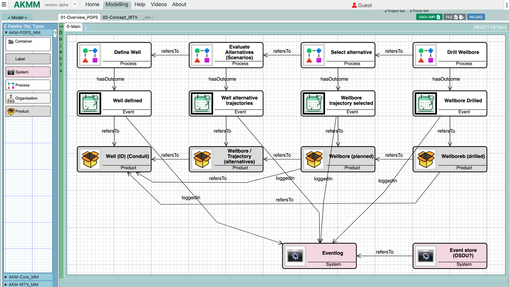

# Mimris-Modeling-App 🎨

[](https://www.gnu.org/licenses/gpl-3.0)


Open-source Modelling tool with Graphical Diagram Editor using Cyclic   Entity-based Modeling and Metamodelling capabilities.



[Powered by GoJS](https://gojs.net)

## Table of Contents

- [Mimris-Modeling-App 🎨](#mimris-modeling-app-)
  - [Table of Contents](#table-of-contents)
  - [🏗️ Tech Stack](#️-tech-stack)
  - [✨ Features](#-features)
  - [Quick Start �](#quick-start-)
  - [Installation 📦](#installation-)
    - [Prerequisites](#prerequisites)
  - [Usage 🖌️](#usage-️)
    - [Basic user Workflow](#basic-user-workflow)
  - [Development 💻](#development-)
    - [Project Structure](#project-structure)
    - [Run Tests](#run-tests)
  - [🧩 State Management](#-state-management)
    - [Redux Store Structure](#redux-store-structure)
  - [📐 Diagram Engine](#-diagram-engine)
    - [GoJS Configuration](#gojs-configuration)
  - [Contributing 🤝](#contributing-)
  - [License 📄](#license-)
- [AKM Modeller](#akm-modeller)
- [Develop branch used for deployment of beta versjon](#develop-branch-used-for-deployment-of-beta-versjon)
  - [The codebase](#the-codebase)

## 🏗️ Tech Stack

- **Frontend Framework**: Next.js 13 (Page Router)
- **Language**: TypeScript 5+
- **Diagram Library**: GoJS 3.0
- **State Management**: Redux Toolkit
- **Rendering**: React 18 (Server Components)
- **Build System**: Turborepo
- **Styling**: Tailwind CSS + CSS Modules + Shadcn

## ✨ Features

- **Basic Knowledge graph**
  - Object/node Relationship/edge arrays based on types defined in Metamodel with Objecttype and Relationshiptypes.
- **📐 GoJS-Powered Node Editor**
  - Objectview and Relationship in Modelviews(diagrams) for presentation of views.
  - Advanced Relationship/link routing and automatic layout.
  - Objectviewstyles to define visualisation of objects and relationships.
- **Next.js Optimized Rendering**
- **Redux State Syncing**
  - Real-time collaboration through state synchronization
  - Time-travel debugging capabilities
- **Type-Safe Development**
  - Strict TypeScript configuration
  - Generated API types from OpenAPI spe
- Customizable templates & components
- Web based Cross-platform support (Windows/Linux/macOS)

## Quick Start �

- **Clone repository

```bash
# Clone the repository
git clone https://github.com/Mimris/mimris-modelling-app.git
cd mimris-modelling-app
```bash

- **Install dependencies

```bash
# Install with npm
npm install
```

- **Launch development mode

```bash
# Start the development server
npm run dev
```

## Installation 📦

### Prerequisites

- Node.js v18+
- npm v9+
- Next.js v13+
- GoJS v2.2+

See [INSTALLATION.md](/docs/INSTALLATION.md) for detailed instructions.

## Usage 🖌️

### Basic user Workflow 

1. Drag Objecttypes from the Palette in to the modelling area
2. Connect nodes using relationships. Click on the obects edge and drag to another object to create a relationship
3. Arrange the objects in the modelling area by dragging them to the desired position and arrange them in Containers.
4. Click on the Hamburger menu in the top left corner to open the menu to Save, Export or Import a model.

## Development 💻

### Project Structure

```
/public     - Static files
/docs       - Documentation files
/src
  /components - React components
    /utils      - Utility functions
  /hooks      - Custom hooks
  /styles     - CSS styles
  /akmm       - akmm modules
  /pages       - Next.js pages
    /api         - API routes
    /helpblogs - Help blogs
  /posts       - Blog posts
  /reducers    - Redux reducers
  /store      - Redux store
  /saga       - Redux saga
  /defs      - ?
  /modelProjects - Model projects

```

### Run Tests

```bash
npm test (no tests implemented yet)
```

## 🧩 State Management

### Redux Store Structure

```typescript
initialState = {
  phData, // Metamodel and Model data
  phFocus, // Current focus data. i.e. focusModel, focusModelview, focusObjectvieiw etx.
  phUser, // User preferences
  phSource, // Sourcefile (local or github)
  lastUpdate: new Date().toISOString()
}
```

## 📐 Diagram Engine

### GoJS Configuration

```typescript
// lib/gojsConfig.ts
import * as go from 'gojs';

export function initializeDiagram(): go.Diagram {
  const $ = go.GraphObject.make;

  return $(go.Diagram, {
    'undoManager.isEnabled': true,
    layout: $(go.ForceDirectedLayout),
    model: $(go.GraphLinksModel, {
      linkKeyProperty: 'key'
    })
  });
}

// Custom node template
export const nodeTemplate = (
  <Node
    locationSpot={go.Spot.Center}
    selectionAdorned={true}
  >
    <Shape
      figure="Rectangle"
      fill="#2F80ED"
      strokeWidth={0}
    />
    <TextBlock
      text="{name}"
      margin={8}
      stroke="white"
    />
  </Node>
);
```

## 📚 Documentation

Mimris documentation is published as a GitHub Pages site backed by the [`docs/`](docs/) directory.

- **Landing page** – https://mimris.github.io/mimris/
- **Getting started guide** – https://mimris.github.io/mimris/getting-started

To update the site, edit the markdown files under [`docs/`](docs/) and open a pull request. After the changes are merged to the default branch, GitHub Pages will automatically rebuild and deploy the latest content.

## Contributing 🤝

We welcome contributions to the Mimris Modelling App! Whether you're fixing bugs, adding features, or improving documentation, your help is appreciated.
We welcome contributions under these guidelines:

1. Fork the repository
2. Create a feature branch
3. Submit a pull request

Review our [CONTRIBUTING GUIDE](CONTRIBUTING.md) before submitting code.

Priority Areas:

- 🐛 Bug fixes
- 📖 Documentation improvements
- 🔒 Security enhancements
- 🧩 Migrate from Redux to Redux Toolkit
- 🧩 Migrate from Bootstrap CSS to TailwindCSS and Shadch
- 🧩 Enhance GoJS Dialogs and Menus (Shadcn?)
- 🧩 Add more examples and documentation
- 🧩 Add tests
- 🧩 Add more components
- 🧩 Add more features
- 🧩 Add more templates
- 🧩 Add more themes
- 🧩 Add more Metamodels
- 🧩 Add more modelling tools
- 🧩 Add more modelling languages
- 🧩 Add more modelling paradigms/metamodels
- 🧩 Add more modelling techniques
- 🧩 Add more modelling methods
- 🧩 Add more modelling frameworks
- 🧩 Add more modelling standards

## License 📄

This project is licensed under the GNU General Public License v3.0 - see [LICENSE](LICENSE) file for details.

**Key License Requirements:**

- All derivative works must remain open-source
- Modifications must be clearly marked
- Source code must be distributed with any binaries

---

---

**Maintained by** [Mimris]

•
 📧 <contact@example.com>

 •
[Live Demo](kmmclient-alfa.vercel.app/modelling)


# AKM Modeller

AKM Modeller is the tool for building Active Knowledge Models, a modelling tool with integrated Use-case Modeling and Meta-modelling capabilities.

Its build on some of the same concepts implemented I Metis (1985-2007) which was written in  C++. 
AKM modeller is written in JavaScript and TypeSctipt, using libraries like:  Next.js, React, Redux, Gojs ....

# Develop branch used for deployment of beta versjon

<!-- 

<!-- 

<video width="420" height="240" controls>
  <source src="https://akmclient-beta.herokuapp.com/videos/AKMM-Getting-Started-1.mp4" type="video/mp4">
</video>
-->

## The codebase


Akmclient is a collection of functions and components written in TypeScript and React for this Modelling application.
There are two main code parts:

 1. AKMM code
 This code is JavaScript/TypeScript Object-oriented programming and is handeling all AKMM modelling parts, i.e. the the model, modelview, object- relationship, objectview- relationshipview, and the integration with GOJS graphical  diagram library.
 The main principal for AKMM modelling is that the model has a collection of Objects and Relationships.
 Wi have modelviews that has collection of Objectviews and Reltationshipviews that refer to the Objects and Relationships. This means that and object can have many objectviews. These Objectviews can be in same or different Modelviews.

 1. The Frontend backend part, functional programmed handeling the Single page App with integration with Redux store,  API's to GitHub, localStorage and the filesystem.
 To keep track of the state of the App, we have implemented a state focus object that set the focus/context of the current  situation lig current: model, modelview, object, objectview, relationship, relationshipview, current role and task, organisation and project.
 This means that when a Project file is loaded, the state will be set to current focus.
 This focus will be changed every time the user select an item in the modelling area (modelview)


 The functions and components are responsible for handling various tasks such as updating the properties of objects and relationships, handling events on the diagram, toggling tasks, dispatching data to the store, and loading data from local storage, local files or GigHub. 
 The code also includes functions for setting and updating the focus of the application, refreshing the objects, and handling the state of the application. Overall, the code is used to manage the state and behavior of the modeling application.

AKM client is a collection of functions and components written in TypeScript and React for a modeling application. The functions and components are responsible for handling various tasks such as updating the properties of objects and relationships, handling events on the diagram, toggling tasks, dispatching data to the store, and loading data from local storage. The code also includes functions for setting and updating the focus of the application, refreshing the objects, and handling the state of the application. Overall, the code is used to manage the state and behavior of the modeling application.

