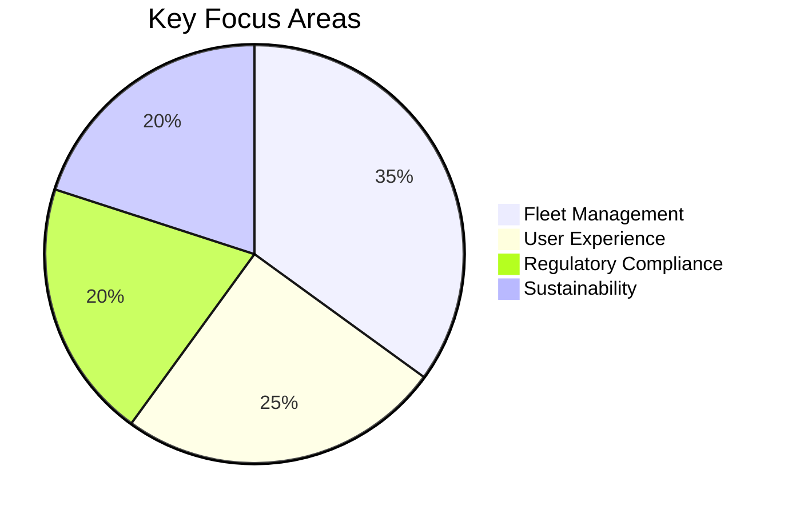

Help me define and scope the following domain/topic:
Domain Identification:
 • Domain Name: [Insert concise and specific name]
 • Domain Description: [Provide a clear, concise summary (2-3 sentences) that captures the essence and significance of the domain.]
Domain scope:
 • In-Scope: [Explicitly list the elements, activities, or areas included within the domain.]
 • Out-of-Scope: [Clearly specify what aspects are explicitly excluded from the domain.]
Key Domain Concepts and Terms
 • Core Concepts: [List critical concepts fundamental to understanding the domain.]
 • Relevant Keywords: [Provide key terminologies, acronyms, and types relevant to the domain.]
Primary objectives: [Clearly define the main goals or outcomes this domain aims to achieve]
Key stakeholders:
Identify and categorize stakeholders by their roles or involvement:
 • Primary Stakeholders: [Directly involved individuals or groups]
 • Secondary Stakeholders: [Indirectly impacted individuals or groups]
Current limitations and Boundaries:
Outline existing constraints, limitations, and boundaries (technical, organizational, financial, regulatory, or operational)
    • Constraint/Boundary 1
 • Constraint/Boundary 2
Success criteria:
Define clear, measurable, and achievable indicators of success:
 • [Success Criterion 1] (Measurable)
 • [Success Criterion 2] (Measurable)

---

---

---

# Domain Definition and Scoping: **Urban Micro-Mobility Solutions**  

## **Domain Identification**  

- **Domain Name:** Urban Micro-Mobility Solutions  
- **Domain Description:**  
  Focuses on shared, short-distance transportation systems (e.g., bike/scooter rentals) in urban areas. Aims to reduce traffic congestion and carbon emissions by providing affordable, on-demand alternatives to cars. Combines technology, logistics, and sustainability to transform urban transit.  

---

## **Domain Scope**  

### **In-Scope**  

- Shared bike/e-scooter rental services  
- Dockless and station-based systems  
- Mobile app-based booking/payment  
- Fleet management (maintenance, redistribution)  
- Partnerships with municipalities/corporations  
- User safety and accessibility features  

### **Out-of-Scope**  

- Long-term vehicle rentals (e.g., monthly car leases)  
- Public transit operations (buses, trains)  
- Private bike ownership models  
- Infrastructure development (road construction)  

---

## **Key Domain Concepts and Terms**  

### **Core Concepts**  

1. **Last-Mile Connectivity:** Bridging gaps between transit hubs and destinations.  
2. **Fleet Optimization:** AI-driven bike/scooter redistribution.  
3. **Dockless Systems:** GPS-enabled free-floating vehicles.  
4. **Dynamic Pricing:** Surge pricing based on demand/time.  

### **Relevant Keywords**  

- **Acronyms:** IoT (Internet of Things), GPS (Global Positioning System), SaaS (Software-as-a-Service)  
- **Terminology:** Geofencing, ride-share compliance, carbon footprint, PMDs (Personal Mobility Devices)  

---

## **Primary Objectives**  

1. **Reduce Urban Congestion:** Replace short car trips with micro-mobility options.  
2. **Enhance Accessibility:** Affordable transit for low-income commuters.  
3. **Sustainability:** Lower CO₂ emissions via zero-carbon transport.  
4. **Profitability:** Scalable unit economics via rentals/ads/partnerships.  

---

## **Key Stakeholders**  

### **Primary Stakeholders**  

- **Users:** Tourists, daily commuters, students  
- **Operators:** Fleet managers, app developers, maintenance crews  
- **Investors:** Venture capitalists, municipal funds  

### **Secondary Stakeholders**  

- **Local Governments:** Permit issuers, urban planners  
- **Businesses:** Retailers near docking stations  
- **Environmental Groups:** Advocates for emission reduction  

---

## **Current Limitations and Boundaries**  

### **Constraints**  

1. **Regulatory:** City-specific bans on dockless systems.  
2. **Technical:** GPS accuracy issues in dense urban areas.  
3. **Financial:** High upfront costs for fleet/IoT infrastructure.  
4. **Behavioral:** User reluctance to replace car commutes.  

### **Boundaries**  

- Limited to cities with population >500,000 (initial rollout).  
- Excludes non-electric vehicles (focus on e-bikes/scooters).  

---

## **Success Criteria**  

1. **Adoption Rate:** ≥15% of target population as active users within 12 months.  
2. **Utilization Rate:** ≥5 rides/vehicle/day (industry benchmark).  
3. **Sustainability:** 30% reduction in user-reported car trips.  
4. **Profitability:** Break-even within 18 months (unit economics).  

---

### **Visual Summary**  

*Note: Adapt scope/objectives based on target city size and funding stage (e.g., pilot vs. scale-up).*
